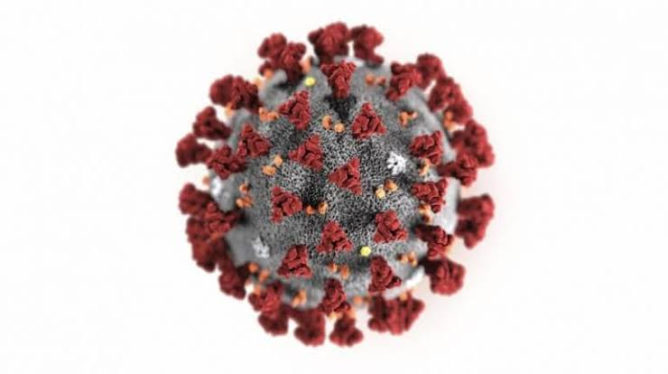

<html>
 <head> 
  <meta name="viewport" content="width=device-width, initial-scale=1.0"> 
   
 </head> 
 <body> 
  <header> 
   Covid-19 Tracker 
  </header> 
  <form> 
   <select id="state"></select>
  </form> 
  <blink id="blink"> 
   <i>Note: If you want to see another state details, please hit to default button.</i> 
  </blink> 
  <button id="btn" onclick="sta(this)">Submit</button> 
  <button id="rbtn" onclick="remove()">To default</button>
  
 </body>
</html>
